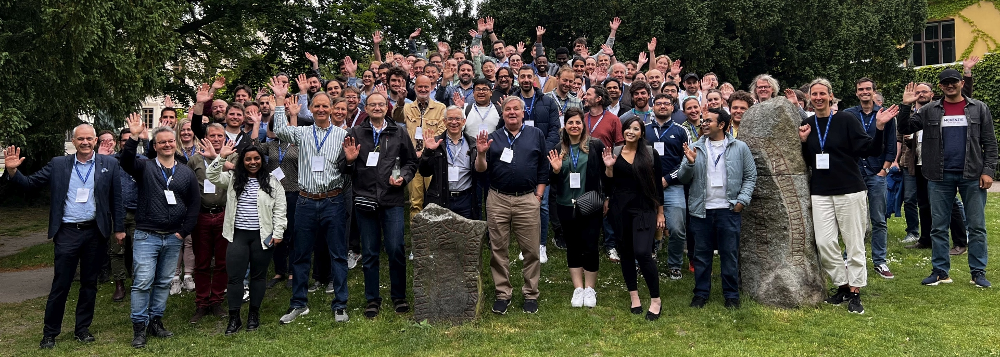

## Group photo taken at the 7th IP workshop in Lund, Sweden, 2024

## Website list
This is a list of websites for past International Induced Polarization Workshops. Some websites are no longer available. 
- [7th International IP workshop, Lund, Sweden, 2024](https://internationalipworkshop.com/)
- [6th International IP workshop, Annecy, France, 2022](https://sites.google.com/view/ipworkshop6/home)
- [5th International IP workshop, Newark, USA, 2018](https://sasn.rutgers.edu/news-events/events/5th-international-workshop-induced-polarization)
- [4th International IP workshop, Aarhus, Denmark, 2016](https://hgg.au.dk/past/ip2016/)
- [3rd International IP workshop, Oléron, France, 2014](https://ip.geosciences.mines-paristech.fr/)
- 2nd International IP workshop, Golden, USA
- 1st International IP workshop, Bonn, Germany